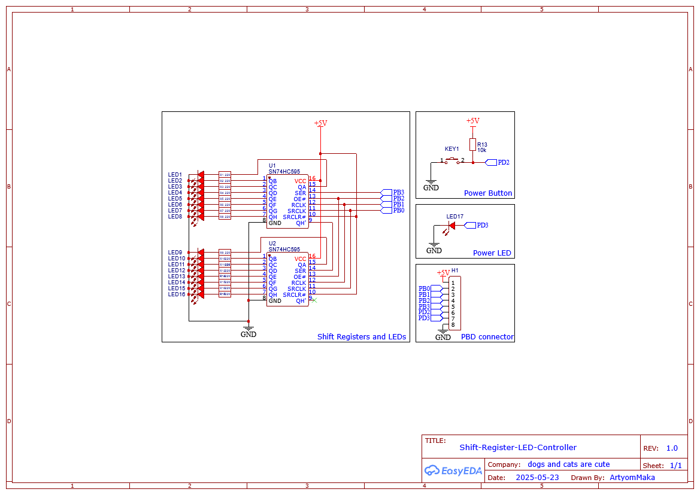

# Shift-Register-LED-Controller
Управление светодиодами с помощью 2х регистров сдвига
# 🔁 Shift Register LED Controller (16-bit)

Простой Arduino-проект, использующий сдвиговый регистр для управления 16-ю выходами поочерёдно. Включает функциональность кнопки питания и светодиода состояния.

---

## 📌 Описание

Эти скетчи реализует управление 2мя 8-битными сдвиговыми регистрами. Состояния выводов чередуются каждые 1000 мс между двумя шаблонами: 
`0b0101010101010101` и `0b1010101010101010`.

Также реализована кнопка, которая переключает режим **включено/выключено**:
- При выключении — все биты сдвигового регистра сбрасываются.
- Светодиод "POWER" указывает на активность схемы.

---

## 🧠 Основная логика

- Каждую секунду состояние регистров переключается.
- При нажатии кнопки состояние выходов регистров сбрасывается.

---

## ⚙️ Подключения

| Название                  | Пин Arduino | Направление | Назначение                 |
|---------------------------|-------------|-------------|----------------------------|
| SERIAL_INPUT              | PB3         | Выход       | Данные в сдвиговый регистр |
| OUTPUT_ENABLE             | PB2         | Выход       | OE (активный низкий)       |
| STORAGE_REGISTER_CLOCK    | PB1         | Выход       | Latch                      |
| SHIFT_REGISTER_CLOCK      | PB0         | Выход       | Clock                      |
| POWER_BUTTON              | PD2         | Вход        | Кнопка (pull-up)           |
| POWER_LED                 | PD3         | Выход       | Светодиод состояния        |

---

## 🛠 Требования

- Arduino Uno или совместимая плата или STM32f0103c8t6 или совместимая
- Сдвиговый регистр (например, 74HC595 x2)
- 16 светодиодов и резисторы
- Кнопка
- Соединительные провода

---

## 📂 Структура

project/
├── Arduino/
│ └── main.ino
├── STM/
│ └── Loading...
├──.gitignore
├── LICENSE
├── README.md
└── wiring_diagram.png

---

## ▶️ Как использовать

1. Залей скетч на Arduino или STM.
2. Подключи сдвиговые регистры и светодиоды согласно wiring_diagram.png.
3. Нажимай на кнопку — схема будет включаться/выключаться.
4. Светодиоды начнут мигать по заданному шаблону.

---

## 📷 Схема подключения

---

## 🧾 Лицензия

Проект распространяется под лицензией MIT. См. файл [`LICENSE`](./LICENSE).

---

## ✍️ Автор

Автор: [ArtyomMaka]  
Год: 2025  
